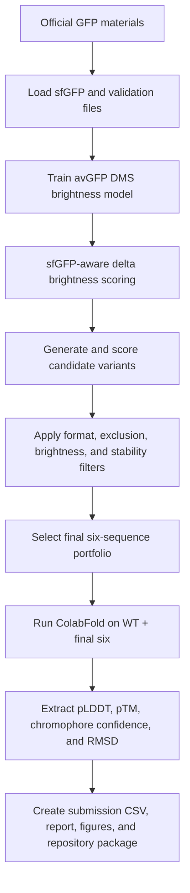

# GeneMeow GFP Design Pipeline

Computational design and validation workflow for the GFP design challenge. The goal was to submit six GFP-family amino acid sequences with a balanced expectation of high initial fluorescence brightness and improved post-heat fluorescence retention.

This repository contains the final **Team GeneMeow** submission package: sequence file, design report, code, ColabFold structural validation outputs, figures, and summary metrics.

---

## Final submission

The final competition file is:

```text
outputs/submission_GeneMeow.csv
```

It follows the required format exactly:

```text
Team_Name,Seq_ID,Sequence
```

Submission summary:

```text
Team_Name = GeneMeow
number of sequences = 6
sequence length = 238 aa for all submitted variants
parent scaffold = sfGFP
chromophore motif = TYG at positions 65–67
```

All six submitted sequences:

- start with methionine `M`;
- contain only the 20 standard amino acids;
- have length 238 aa, within the required 220–250 aa interval;
- preserve the sfGFP chromophore-forming motif `TYG` at positions 65–67;
- do not exactly match `Exclusion_List.csv` or the previous top-sequence list;
- passed sfGFP-aware brightness sanity checking;
- passed ColabFold structural sanity checking.

---

## Project objective

The competition evaluates each submitted protein sequence experimentally using two component scores:

```text
Relative brightness score = Finitial / FinitialWT
Thermal stability retention score = Ffinal / Finitial
Comprehensive score = (Finitial / FinitialWT) × (Ffinal / Finitial)
                    = Ffinal / FinitialWT
```

The official facility synthesizes the DNA templates, expresses proteins in a cell-free protein synthesis system, measures initial brightness, applies heat treatment, and measures post-heat brightness.

Our workflow does **not** claim to directly predict the final experimental score. Instead, it prioritizes variants that are expected to preserve initial brightness while improving the probability of post-heat fluorescence retention.

---

## Execution environment

All computational work for this repository was performed in **Google Colab**. The standard design/validation pipeline was run in a Colab Python runtime, and the structural validation was run in a Colab GPU runtime using ColabFold AlphaFold2_batch.

The repository keeps the code in plain Python files so the non-GPU parts can also be checked locally, but the intended and documented execution environment is Google Colab.

---

## Required official input files

The full workflow uses the official competition materials. In this repository they are stored in:

```text
data/AAseqs of 5 GFP proteins_20260511.txt
data/GFP_data.xlsx
data/Exclusion_List.csv
data/submission_template.csv
```

For the original Google Colab run, the same files were available in the working directory as:

```text
/content/AAseqs of 5 GFP proteins_20260511.txt
/content/GFP_data.xlsx
/content/Exclusion_List.csv
/content/submission_template.csv
```

The repository also includes a lightweight reference file:

```text
data/reference_sequences.fasta
```

---

## ColabFold structural validation

ColabFold is treated as an **external Google Colab tool**, not as a locally maintained script in this repository. This is intentional: ColabFold notebooks are frequently updated, depend on the current Google Colab runtime, and may break if an exported `.py` copy is committed and run later as a standalone script.

Use the official ColabFold resources instead:

```text
Official ColabFold GitHub:
https://github.com/sokrypton/ColabFold

Official AlphaFold2_batch notebook:
https://colab.research.google.com/github/sokrypton/ColabFold/blob/main/batch/AlphaFold2_batch.ipynb

Notebook source on GitHub:
https://github.com/sokrypton/ColabFold/blob/main/batch/AlphaFold2_batch.ipynb
```

The prepared ColabFold inputs are already included in this repository. There are two equivalent formats.

One FASTA file per sequence:

```text
input/WT_sfGFP.fasta
input/Seq1_conservative_surface_D19E_R73L_H231Y.fasta
input/Seq2_balanced_core_D19E_R73L_H231Y_K166E_N212D.fasta
input/Seq3_MAIN_balanced_D19E_R73L_H231Y_N198D_N212D_K166E.fasta
input/Seq4_BEST_thermal_D19E_R73L_H231Y_N198D_N212D_K166E_K156E_K101E.fasta
input/Seq5_BEST_brightness_D19E_R73L_H231Y_Y237N.fasta
input/Seq6_INSURANCE_supercharge_K166E_N212D_K101E_K156E_N198D.fasta
```

The Google Drive layout used in the original Colab run was:

```text
/content/drive/MyDrive/colab_fold/input_fasta/WT_sfGFP.fasta
/content/drive/MyDrive/colab_fold/input_fasta/Seq1_conservative_surface_D19E_R73L_H231Y.fasta
/content/drive/MyDrive/colab_fold/input_fasta/Seq2_balanced_core_D19E_R73L_H231Y_K166E_N212D.fasta
/content/drive/MyDrive/colab_fold/input_fasta/Seq3_MAIN_balanced_D19E_R73L_H231Y_N198D_N212D_K166E.fasta
/content/drive/MyDrive/colab_fold/input_fasta/Seq4_BEST_thermal_D19E_R73L_H231Y_N198D_N212D_K166E_K156E_K101E.fasta
/content/drive/MyDrive/colab_fold/input_fasta/Seq5_BEST_brightness_D19E_R73L_H231Y_Y237N.fasta
/content/drive/MyDrive/colab_fold/input_fasta/Seq6_INSURANCE_supercharge_K166E_N212D_K101E_K156E_N198D.fasta
```

The corresponding Google Drive result directory was:

```text
/content/drive/MyDrive/colab_fold/result/
```

A single multi-FASTA version is also stored for upload to the official batch notebook:

```text
structural_validation/colabfold_input_WT_plus_6designs.fasta
```

All seven ColabFold input sequences are 238 amino acids long and include WT sfGFP plus Seq1–Seq6. The saved ColabFold outputs used for downstream analysis are stored in:

```text
models/colabfold_rank001_final6/
figures/colabfold_raw_plots_final6/
outputs/colabfold_validation_metrics.csv
outputs/final6_colabfold_brightness_metrics.csv
```

Detailed step-by-step ColabFold instructions are provided in:

```text
structural_validation/colabfold_run_instructions.md
```

---

## Pipeline overview



The final design strategy combined:

1. sfGFP as a robust parent scaffold;
2. avGFP DMS-derived brightness evidence;
3. sfGFP-aware delta scoring rather than absolute avGFP-to-sfGFP transfer;
4. moderate negative surface-charge engineering as a thermal-retention proxy;
5. strict format and exclusion checks;
6. ColabFold structural sanity checking;
7. portfolio-based final selection.

---

## Stage 1 — Reference, format, and exclusion checks

The workflow loads the official GFP reference sequences and uses sfGFP as the parent scaffold.

```text
parent scaffold = sfGFP
length = 238 aa
chromophore positions 65–67 = TYG
reference structural scaffold = sfGFP / PDB 2B3P-compatible fold
```

The script checks:

- whether required files are present;
- whether submitted sequences start with `M`;
- whether sequence length is 220–250 aa;
- whether only the 20 standard amino acids are used;
- whether the chromophore motif is preserved;
- whether sequences exactly match `Exclusion_List.csv`;
- whether sequences match the previous top-sequence list from `GFP_data.xlsx`.

The output table for this step is:

```text
outputs/submission_validation_summary.csv
```

---

## Stage 2 — Brightness model from avGFP DMS data

The `brightness` sheet from `GFP_data.xlsx` was used to train a mutation-based model on avGFP variants.

Model:

```text
Ridge regression + isotonic calibration
```

Input representation:

```text
aaMutations → binary mutation features
```

Example:

```text
D19E:R73L:H231Y
```

is encoded as:

```text
D19E = 1
R73L = 1
H231Y = 1
```

Observed model performance:

```text
avGFP rows used: 51715
mutation features: 1810
raw Ridge test R²: 0.6878
Ridge + isotonic test R²: 0.933
Ridge + isotonic test MAE: 0.160
```

Important methodological choice:

The avGFP-trained model was **not** used as an absolute predictor of full sfGFP brightness. Direct full-sequence avGFP-to-sfGFP transfer can saturate and become misleading. Instead, the final pipeline uses mutation-level delta effects relative to sfGFP.

---

## Stage 3 — sfGFP-aware brightness delta scoring

The final brightness validation uses a delta-score approach.

Key correction:

```text
avGFP DMS dataset position = protein position - 1
```

For example, a protein-level mutation at position 231 is mapped to DMS position 230.

For each mutation, the model checks:

- whether the mutation is measured in avGFP DMS data;
- whether the mutation has sufficient support;
- whether the reference residue in sfGFP matches the avGFP DMS reference context;
- whether the mutation needs to be estimated from position-level information.

The final brightness score is reported as:

```text
SfGFP_Delta_Brightness_Score
```

Interpretation:

```text
positive score  → predicted to be at least as bright as sfGFP under the DMS-derived prior
near-zero score → approximately sfGFP-like brightness prior
negative score  → potential brightness risk
```

All final six designs have positive delta brightness scores and pass brightness sanity checking.

---

## Stage 4 — Stability proxy

No large public dataset directly predicts the official 72°C post-heat brightness retention. Therefore, thermal performance was treated as a proxy rather than a measured or directly predicted value.

The stability proxy combines:

1. sfGFP as an already robust scaffold;
2. moderate negative surface-charge shift;
3. selected supercharging mutations such as `K101E`, `K156E`, `K166E`, `N198D`, and `N212D`;
4. risk penalties for excessive mutational load.

Approximate net charge is computed as:

```text
K/R = +1
D/E = -1
H   = +0.1
```

The charge shift is:

```text
Charge_Delta_More_Negative_vs_sfGFP = sfGFP_net_charge - candidate_net_charge
```

A higher positive value means the variant is more negatively charged than sfGFP.

The stability proxy is not a melting temperature and not a direct `Ffinal` prediction. It is a ranking heuristic for thermal-retention potential.

---

## Stage 5 — Final design portfolio

The final six sequences were selected to cover complementary design hypotheses.

| Seq_ID | Role | Mutations | Brightness delta | Stability proxy |
|---:|---|---|---:|---:|
| 1 | conservative surface-brightness candidate | D19E:R73L:H231Y | 0.382 | 0.316 |
| 2 | balanced charge/brightness candidate | D19E:R73L:K166E:N212D:H231Y | 0.433 | 1.222 |
| 3 | main balanced candidate | D19E:R73L:K166E:N198D:N212D:H231Y | 0.500 | 1.507 |
| 4 | high-charge thermal candidate | D19E:R73L:K101E:K156E:K166E:N198D:N212D:H231Y | 0.544 | 1.304 |
| 5 | brightness-focused backup | D19E:R73L:H231Y:Y237N | 0.556 | 0.316 |
| 6 | supercharged thermal insurance candidate | K101E:K156E:K166E:N198D:N212D | 0.162 | 1.561 |

Rationale:

- Seq 1 provides a conservative low-mutational-load baseline.
- Seq 2 and Seq 3 provide balanced brightness and moderate supercharging.
- Seq 4 is a higher-risk, higher-charge thermal-retention candidate.
- Seq 5 is a brightness-oriented backup.
- Seq 6 is a strong thermal/supercharge insurance design without the terminal H231Y mutation.

### Note on the two brightness models

Brightness has two independent estimates, kept as a convergent cross-check (this is intentional, not an inconsistency):

- **Canonical (Claude branch)** — `outputs/design_report.csv`: model with 1810 mutation features, held-out R² = 0.933; deltas 0.382 / 0.433 / 0.500 / 0.544 / 0.556 / 0.162. These are the values used in this README and in the design document.
- **Cross-check (ChatGPT branch)** — `outputs/final6_colabfold_brightness_metrics.csv`, `outputs/colabfold_validation_metrics.csv`, and `outputs/submission_validation_summary.csv`: an independent brightness model (1703 features, R² = 0.9214; deltas 0.170 / 0.283 / 0.346 / 0.379 / 0.279 / 0.209) reported next to the ColabFold structural metrics.

Both models agree all six designs score ≥ sfGFP and both verified the −1 numbering offset; they differ only in magnitude and fine ranking. The Claude model is canonical.

---

## Stage 6 — ColabFold structural validation

The final six designs plus WT sfGFP were evaluated with ColabFold AlphaFold2_batch in Google Colab GPU runtime.

ColabFold input paths:

```text
input/WT_sfGFP.fasta
input/Seq1_conservative_surface_D19E_R73L_H231Y.fasta
input/Seq2_balanced_core_D19E_R73L_H231Y_K166E_N212D.fasta
input/Seq3_MAIN_balanced_D19E_R73L_H231Y_N198D_N212D_K166E.fasta
input/Seq4_BEST_thermal_D19E_R73L_H231Y_N198D_N212D_K166E_K156E_K101E.fasta
input/Seq5_BEST_brightness_D19E_R73L_H231Y_Y237N.fasta
input/Seq6_INSURANCE_supercharge_K166E_N212D_K101E_K156E_N198D.fasta
structural_validation/colabfold_input_WT_plus_6designs.fasta
```

ColabFold settings:

```text
input_dir = /content/drive/MyDrive/colab_fold/input_fasta
result_dir = /content/drive/MyDrive/colab_fold/result
MSA mode = MMseqs2 UniRef + Environmental
number of models = 5
number of recycles = 3
templates = disabled
Amber relaxation = disabled
ranking = pLDDT / auto
```

Extracted structural metrics:

```text
Mean pLDDT
pTM
minimum chromophore pLDDT at positions 65–67
core pLDDT for residues 1–220
core RMSD to WT sfGFP
core mutation-site pLDDT
terminal mutation pLDDT for residues 221–238, when applicable
```

Structural pass criteria:

```text
Mean pLDDT ≥ 90
minimum chromophore pLDDT at positions 65–67 ≥ 85
core RMSD to WT sfGFP ≤ 1.0 Å
```

All final six candidates passed structural validation.

---

## Final six ColabFold metrics

| Seq_ID | Mean pLDDT | pTM | Chromophore pLDDT min | Core RMSD to WT, Å | Core mutation-site pLDDT min | Structural pass |
|---:|---:|---:|---:|---:|---:|---|
| 1 | 96.205 | 0.91 | 95.38 | 0.125 | 98.12 | pass |
| 2 | 96.172 | 0.91 | 95.75 | 0.040 | 97.75 | pass |
| 3 | 96.233 | 0.91 | 96.00 | 0.042 | 97.12 | pass |
| 4 | 96.330 | 0.91 | 95.31 | 0.123 | 95.88 | pass |
| 5 | 96.327 | 0.91 | 94.88 | 0.128 | 98.12 | pass |
| 6 | 96.219 | 0.91 | 94.75 | 0.115 | 95.75 | pass |

Detailed metrics are available in:

```text
outputs/final6_colabfold_brightness_metrics.csv
outputs/colabfold_validation_metrics.csv
```

Note on terminal mutations:

Some variants include mutations near the flexible C-terminus, especially `H231Y` and `Y237N`. These terminal positions can have lower local pLDDT, but the GFP core, chromophore region, and core mutation sites remain high-confidence. Therefore, terminal pLDDT was tracked separately and was not treated as evidence of β-barrel disruption.

---

## Figures

The following figures are included in the repository and the design report:

```text
figures/final6_brightness_delta.png
figures/final6_stability_proxy.png
figures/final6_mean_plddt.png
figures/final6_chromophore_plddt.png
figures/final6_core_rmsd.png
figures/final6_brightness_vs_stability.png
```

Raw ColabFold plots are stored in:

```text
figures/colabfold_raw_plots_final6/
```

These include pLDDT, predicted aligned error, and MSA coverage plots for WT sfGFP and the final six designs.

---

## How to reproduce

The original work was performed in Google Colab. The commands below reproduce the non-GPU design checks in a Colab runtime and use ColabFold in a Colab GPU runtime.

### 1. Install dependencies

In Google Colab:

```python
!pip install -q pandas numpy matplotlib scikit-learn openpyxl biopython reportlab python-docx
```

Optional local sanity check:

```bash
python -m venv .venv
source .venv/bin/activate
pip install -r requirements.txt
```

---

### 2. Run the design and validation pipeline

Run:

```bash
python run_pipeline.py
```

or use the modular scripts in `src/` and `scripts/`.

Main components:

```text
src/brightness_model.py          baseline avGFP DMS brightness model
src/sfgfp_brightness_model.py    sfGFP-aware delta brightness scoring
src/design.py                    final sequence definitions and design logic
src/verify.py                    format and exclusion checks
src/reliability_screen.py        reliability and risk scoring
```

---

### 3. Run ColabFold

The ColabFold part was run in Google Colab GPU runtime using the official ColabFold AlphaFold2_batch notebook, not a repository-maintained exported script.

Official notebook:

```text
https://colab.research.google.com/github/sokrypton/ColabFold/blob/main/batch/AlphaFold2_batch.ipynb
```

Option A: copy the individual FASTA files to Google Drive and use them as the batch input directory:

```python
from google.colab import drive
drive.mount('/content/drive')

!mkdir -p /content/drive/MyDrive/colab_fold/input_fasta
!cp input/*.fasta /content/drive/MyDrive/colab_fold/input_fasta/
```

Input directory used in the original run:

```text
/content/drive/MyDrive/colab_fold/input_fasta
```

Output directory used in the original run:

```text
/content/drive/MyDrive/colab_fold/result
```

Option B: upload the prepared multi-FASTA directly to the official ColabFold AlphaFold2_batch notebook:

```text
structural_validation/colabfold_input_WT_plus_6designs.fasta
```

Recommended settings:

```text
msa_mode = MMseqs2 (UniRef+Environmental)
model_type = AlphaFold2-ptm
num_models = 5
num_recycles = 3
use_templates = False
num_relax = 0
rank_by = pLDDT
zip_results = True
```

---

### 4. Process ColabFold results

Use:

```bash
python structural_validation/process_colabfold_results_final6_memory_safe.py
```

This extracts pLDDT, pTM, chromophore pLDDT, core RMSD to WT sfGFP, mutation-site pLDDT, and writes summary tables.

The memory-safe script does not archive the full extracted ColabFold folder, because raw ColabFold outputs can be large.

---

## Final competition files

Submit these three items to the competition system:

```text
outputs/submission_GeneMeow.csv
docs/design_concept_GeneMeow.pdf
public GitHub repository URL
```

The CSV is the official sequence file. The PDF explains the computational design concept and includes figures. The GitHub repository provides code, tables, structural validation outputs, and report files for reproducibility.

---

## Limitations

This is a computational prioritization workflow, not an experimental validation.

Main limitations:

1. The brightness model is derived from avGFP DMS data and used as a mutation-level prior, not as an exact predictor of the official CFPS brightness assay.
2. The stability proxy is not a measured melting temperature and not a direct predictor of `Ffinal` after 72°C treatment.
3. ColabFold validates fold plausibility but does not predict chromophore maturation, extinction coefficient, quantum yield, cell-free expression yield, or thermal fluorescence retention.
4. The true ranking can only be determined by the official synthesis, expression, heat-treatment, and fluorescence measurements.

---

## Team

```text
Team name: GeneMeow
Task: Computational design of GFP variants with high fluorescence brightness and thermal stability retention
Final submission file: outputs/submission_GeneMeow.csv
Design report: docs/design_concept_GeneMeow.pdf
Agent workflow log: docs/agent_workflow_combined_GeneMeow.md
```
