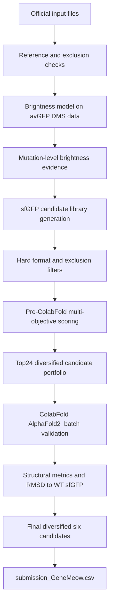

# GeneMeow GFP Design Pipeline

Computational design of GFP variants with a dual objective: preserving high initial fluorescence brightness and improving the probability of post-heat fluorescence retention.

This repository contains the full reproducible workflow used by **Team GeneMeow** for the GFP design challenge. The final output is a set of six amino acid sequences selected from an sfGFP-based candidate library using DMS-derived brightness evidence, stability-oriented mutation priors, ColabFold structural validation, and portfolio-based final selection.

---

## Project objective

The competition objective is to design GFP-family protein sequences with:

1. **High initial brightness**
   Evaluated experimentally as:

   ```text
   Finitial / FinitialWT
   ```

2. **High thermal stability retention**
   Evaluated experimentally as:

   ```text
   Ffinal / Finitial
   ```

3. **High combined performance**

   ```text
   Comprehensive score = (Finitial / FinitialWT) × (Ffinal / Finitial)
                       = Ffinal / FinitialWT
   ```

The official assay will synthesize DNA templates, express proteins in a cell-free protein synthesis system, measure initial brightness, apply heat treatment, and then measure post-heat brightness.

Our computational workflow does **not** claim to directly predict the final experimental score. Instead, it prioritizes candidate sequences that are expected to preserve GFP fluorescence while reducing the risk of thermal denaturation or aggregation.

---

## Repository structure

```text
gfp-2026-genemeow-design/
├── README.md
├── scripts/
│   ├── gfp_2026_design_pipeline.py
│   ├── alphafold2_batch.py
│   └── process_colabfold_archive_memory_safe.py
├── data/
│   └── AAseqs of 5 GFP proteins_20260511.txt
│   └── GFP_data.xlsx
│   └── Exclusion_List.csv
│   └── submission_template.csv
├── outputs/
│   ├── submission_GeneMeow.csv
│   ├── final6_GeneMeow_summary.csv
│   ├── stage4_colabfold_metrics_from_uploaded_archive.csv
│   ├── top24_for_colabfold_v2.csv
│   ├── mutation_evidence_v2.csv
│   ├── stage3_v2_metadata.json
│   └── GeneMeow_minimal_submission_package.zip
├── figures/
│   ├── final6_final_computational_score.png
│   ├── final6_mean_plddt.png
│   ├── final6_chromophore_plddt_min.png
│   ├── final6_core_rmsd_to_wt.png
│   ├── top24_charge_vs_final_score_highlight_final6.png
│   └── colabfold_raw_plots_final6/
├── models/
│   └── colabfold_rank001_final6/
└── docs/
    ├── design_concept_GeneMeow_updated.pdf
```

---

## Required official input files

Expected data layout for local or Colab execution:

```text
/content/
├── AAseqs of 5 GFP proteins_20260511.txt
├── GFP_data.xlsx
├── Exclusion_List.csv
└── submission_template.csv
```

---

## Final submission file

The final competition sequence file is:

```text
outputs/submission_GeneMeow.csv
```

It contains exactly three required columns:

```text
Team_Name,Seq_ID,Sequence
```

The final file contains six designed amino acid sequences:

```text
Team_Name = GeneMeow
Seq_ID    = 1, 2, 3, 4, 5, 6
Sequence  = amino acid sequence, 238 aa
```

All submitted sequences:

* are 238 amino acids long;
* start with methionine `M`;
* contain only the 20 standard amino acids;
* preserve the sfGFP chromophore-forming motif `TYG` at positions 65–67;
* do not exactly match sequences in `Exclusion_List.csv`;
* passed ColabFold structural sanity checks.

---

## Pipeline overview

The complete workflow contains five main stages.



---

## Stage 1 — Reference and format checks

The pipeline first loads the official GFP reference sequences and validates the main scaffold.

The selected parent scaffold is:

```text
sfGFP
length = 238 aa
chromophore positions 65–67 = TYG
recommended reference structure = PDB 2B3P
```

The pipeline also checks:

* `Exclusion_List.csv`;
* `beforetopseqs` from `GFP_data.xlsx`;
* `submission_template.csv`;
* sequence length constraints;
* allowed amino acid alphabet;
* preservation of the chromophore motif.

---

## Stage 2 — Brightness model from avGFP DMS data

The `brightness` sheet from `GFP_data.xlsx` was used to train a mutation-based brightness model on avGFP variants.

Model:

```text
Ridge regression + isotonic calibration
```

Input representation:

```text
aaMutations → binary mutation features
```

Example mutation feature representation:

```text
A109D:N145D:I187V
```

is converted to:

```text
A109D = 1
N145D = 1
I187V = 1
```

The model was trained on avGFP DMS data and used as a brightness-prior model.

Observed model performance:

```text
avGFP rows used: 51715
number of mutation features: 1703
raw Ridge test R²: 0.6935
Ridge + isotonic test R²: 0.9214
Ridge + isotonic test MAE: 0.1700
```

Important limitation:

The avGFP-trained model was **not** used as a direct absolute predictor of sfGFP brightness. Direct full-sequence transfer from avGFP to sfGFP saturated and assigned nearly identical values to many sfGFP-derived candidates. Therefore, the final workflow used mutation-level brightness evidence rather than full-sequence brightness prediction.

---

## Stage 3 — Mutation-level brightness evidence

Instead of predicting absolute fluorescence for each full sfGFP sequence, each candidate was evaluated using mutation-level evidence.

The local brightness score combines:

1. observed single-mutant brightness in avGFP DMS data;
2. Ridge model coefficient for the mutation;
3. sfGFP-specific literature prior for `H148S`;
4. small positive prior for `N164Y`;
5. penalty for risky mutations such as `F46L`.

The implemented brightness evidence score is:

```text
Local_Brightness_Evidence_Score =
sum(local DMS mutation scores)
+ H148S literature-prior bonus
+ N164Y folding/brightness-support bonus
- F46L risk penalty
```

In code:

```python
if "H148S" in mutations:
    score += 1.2

if "N164Y" in mutations:
    score += 0.15

if "F46L" in mutations:
    score -= 0.25
```

The mutation `Q69L` was excluded from the final mutation library because the avGFP-equivalent mutation `Q68L` showed a negative brightness signal.

---

## Stage 4 — Stability proxy

True thermal stability after heat treatment at 72°C was not directly predicted because there is no large public dataset matching the exact official assay.

Instead, we used a stability proxy based on three principles:

1. sfGFP is already a robust folding scaffold;
2. moderate negative surface-charge shift may improve solubility and reduce aggregation;
3. folding-prior mutations may improve scaffold robustness.

Approximate net charge was computed as:

```text
K/R = +1
D/E = -1
H   = +0.1
```

The charge shift was defined as:

```text
Charge_Delta_More_Negative_vs_sfGFP =
sfGFP_net_charge - candidate_net_charge
```

The stability proxy favored a moderate negative charge shift around 6 rather than maximizing charge aggressively:

```text
charge_score = exp(-((charge_delta - 6.0)^2) / (2 × 3.0^2))
```

The full stability proxy was:

```text
Stability_Proxy_Score =
1.20 × charge_score
+ 0.25 × folding_count
+ 0.12 × supercharge_count
```

This score is not an experimental melting temperature or direct `Ffinal` prediction. It is a computational prior used for candidate ranking.

---

## Stage 5 — Risk penalty

The risk penalty prevents the algorithm from selecting highly mutated sequences that might lose brightness due to negative epistasis or folding disruption.

The penalty includes:

```text
0.08 × number of mutations
+ 0.50 if more than 7 mutations
+ 0.10 if multiple terminal mutations
+ 0.15 if F46L is present
```

This encourages conservative and moderate designs rather than overly aggressive mutational combinations.

---

## Stage 6 — Pre-ColabFold multi-objective score

Each generated candidate was scored before structure prediction using:

```text
Pre_ColabFold_MultiObjective_Score =
0.50 × Local_Brightness_Evidence_Score
+ 0.40 × Stability_Proxy_Score
- Risk_Penalty
```

This score balances:

* expected brightness preservation;
* expected thermal-retention potential;
* mutational risk.

---

## Stage 7 — Candidate generation and hard filters

The candidate library was generated by combining mutations from the following groups:

### DMS brightness-safe mutations

```text
L220V
L194M
D102E
L220Q
Q183L
A226T
A226D
V11L
T49S
Q183R
```

### Literature brightness prior

```text
H148S
```

### Negative supercharging / stability proxy

```text
N198D
K101E
K156E
K166E
K214E
N212D
```

### Folding-prior mutations

```text
N164Y
N149K
S208L
```

### Optional risk mutation

```text
F46L
```

Hard filters applied before top24 selection:

```text
length 220–250 aa
starts with M
standard amino acids only
chromophore 65–67 preserved
not exact match in Exclusion_List.csv
not exact match in beforetopseqs
has brightness basis
has stability/folding basis
charge shift is not negative
charge shift is not above 12
no more than 4 negative-supercharging mutations
no more than 1 optional-risk mutation
Q69L excluded due to negative DMS-equivalent Q68L signal
```

After filtering, 134337 candidates remained.

---

## Stage 8 — Top24 selection

The top24 sequences were not selected simply as the 24 highest-scoring candidates. Instead, candidates were selected from five design families to preserve diversity across brightness, charge/stability, and risk classes.

Design families:

| Family                         | Number selected | Purpose                                              |
| ------------------------------ | --------------: | ---------------------------------------------------- |
| conservative_H148S_mild_charge |               5 | low-risk candidates with H148S and mild charge shift |
| balanced_H148S_medium_charge   |               6 | balanced brightness/stability candidates             |
| balanced_H148S_stronger_charge |               6 | stronger charge-shift candidates                     |
| thermal_supercharged_H148S     |               4 | higher-risk thermal-retention candidates             |
| backup_without_H148S           |               3 | backup candidates in case H148S is unfavorable       |

This portfolio strategy was used because the official team ranking depends on the best-performing sequence among the six submitted variants. Therefore, diversity across risk classes is more valuable than submitting six nearly identical high-scoring variants.

---

## Stage 9 — ColabFold structural validation

The top24 candidates plus WT sfGFP were evaluated with ColabFold AlphaFold2_batch.

ColabFold settings:

```text
input: separate FASTA files
number of queries: 25
model type: AlphaFold2 / AlphaFold2-PTM
MSA mode: MMseqs2 UniRef + Environmental
number of models per sequence: 5
number of recycles: 3
template usage: disabled
Amber relaxation: disabled
ranking: pLDDT
```

ColabFold validation was used as a structural sanity check, not as a direct predictor of fluorescence or heat retention.

Metrics extracted from the best-ranked model for each sequence:

```text
Mean pLDDT
pTM
chromophore pLDDT at positions 65–67
core pLDDT for residues 1–220
C-terminal pLDDT for residues 221–238
mutation-site pLDDT
core RMSD to WT sfGFP
```

Structural pass criteria:

```text
Mean pLDDT ≥ 90
minimum chromophore pLDDT at positions 65–67 ≥ 85
core RMSD to WT sfGFP ≤ 1.0 Å
```

All final six candidates passed these structural filters.

---

## Final six selected sequences

The final six were selected as a diversified portfolio rather than as six near-identical top-ranked variants.

| Seq_ID | Query ID              | Role                                      | Mutations                                 |
| -----: | --------------------- | ----------------------------------------- | ----------------------------------------- |
|      1 | Query_02_CANDV2_01071 | conservative low-risk H148S + mild charge | L220V:H148S:K156E:N164Y                   |
|      2 | Query_06_CANDV2_06745 | balanced medium-charge main candidate     | L220V:H148S:K101E:K156E:N164Y             |
|      3 | Query_15_CANDV2_26898 | best overall computational candidate      | L220V:H148S:K156E:K166E:K214E:N164Y       |
|      4 | Query_16_CANDV2_26760 | balanced alternative with N198D           | L220V:H148S:N198D:K101E:K156E:N164Y       |
|      5 | Query_18_CANDV2_77117 | thermal-retention supercharged bet        | L220V:H148S:K101E:K156E:K166E:K214E:N164Y |
|      6 | Query_24_CANDV2_26657 | backup without H148S                      | L220V:Q183R:K101E:K166E:K214E:N164Y       |

---

## Summary of final six ColabFold validation

| Seq_ID | Mean pLDDT |  pTM | Chromophore pLDDT min | Core RMSD to WT, Å | Structural pass |
| -----: | ---------: | ---: | --------------------: | -----------------: | --------------- |
|      1 |       high | 0.91 |                  high |              < 1.0 | pass            |
|      2 |       high | 0.91 |                  high |              < 1.0 | pass            |
|      3 |       high | 0.91 |                  high |              < 1.0 | pass            |
|      4 |       high | 0.91 |                  high |              < 1.0 | pass            |
|      5 |       high | 0.91 |                  high |              < 1.0 | pass            |
|      6 |       high | 0.91 |                  high |              < 1.0 | pass            |

The exact numeric values are available in:

```text
outputs/final6_GeneMeow_summary.csv
outputs/stage4_colabfold_metrics_from_uploaded_archive.csv
```

---

## Figures

The following summary figures were generated for the design report:

```text
figures/final6_final_computational_score.png
figures/final6_mean_plddt.png
figures/final6_chromophore_plddt_min.png
figures/final6_core_rmsd_to_wt.png
figures/top24_charge_vs_final_score_highlight_final6.png
```

Raw ColabFold plots for the final six are stored in:

```text
figures/colabfold_raw_plots_final6/
```

These include per-sequence pLDDT, PAE and MSA coverage plots when available.

---

## How to reproduce the workflow

### 1. Install dependencies

In Google Colab:

```python
!pip install -q pandas numpy matplotlib scikit-learn openpyxl
```

For local execution:

```bash
python -m venv .venv
source .venv/bin/activate
pip install -r requirements.txt
```

---

### 2. Run sequence design pipeline

Place the official files in `/content/` or adjust paths in the script:

```text
/content/AAseqs of 5 GFP proteins_20260511.txt
/content/GFP_data.xlsx
/content/Exclusion_List.csv
/content/submission_template.csv
```

Run:

```bash
python scripts/gfp_2026_design_pipeline.py
```

Main outputs:

```text
all_generated_candidates_ranked_v2.csv
top24_for_colabfold_v2.csv
mutation_evidence_v2.csv
stage3_v2_metadata.json
colabfold_top24_fasta_v2.zip
```

---

### 3. Run ColabFold

Use the ColabFold AlphaFold2_batch notebook or the provided script:

```text
scripts/alphafold2_batch.py
```

Recommended settings:

```text
input_dir = folder with 25 FASTA files
result_dir = Google Drive output folder
msa_mode = MMseqs2 (UniRef+Environmental)
num_models = 5
num_recycles = 3
use_templates = False
num_relax = 0
zip_results = True
```

The input folder should contain:

```text
sfGFP_WT.fasta
Query_01_CANDV2_01064.fasta
...
Query_24_CANDV2_26657.fasta
```

---

### 4. Process ColabFold results

Upload the ColabFold results archive to Colab and run:

```bash
python scripts/process_colabfold_archive_memory_safe.py
```

This script extracts metrics from the uploaded ColabFold archive and creates:

```text
submission_GeneMeow.csv
final6_GeneMeow_summary.csv
stage4_colabfold_metrics_from_uploaded_archive.csv
GeneMeow_figures_for_PDF.zip
GeneMeow_minimal_submission_package.zip
```

The memory-safe script intentionally does not archive the full extracted ColabFold results folder, because that folder can be large and may exceed Colab memory or disk limits.

---

## Final competition files

The three final files required for submission are:

```text
outputs/submission_GeneMeow.csv
docs/design_concept_GeneMeow_updated.pdf
public GitHub repository URL
```

The CSV file contains the six submitted sequences.

The PDF explains:

* workflow;
* scoring logic;
* brightness model;
* stability proxy;
* top24 selection;
* ColabFold validation;
* final sequence selection;
* limitations.

The GitHub repository provides the code and output tables required for reproducibility.

---

## Limitations

This workflow provides computational prioritization, not experimental proof.

Important limitations:

1. The avGFP DMS brightness model is not a direct absolute predictor of sfGFP brightness.
2. The stability score is a proxy, not a measured melting temperature or direct `Ffinal` prediction.
3. ColabFold checks structural plausibility but does not predict chromophore maturation, extinction coefficient, quantum yield, CFPS expression level, or post-heat fluorescence.
4. The true performance of each submitted sequence can only be determined by the official experimental assay.

Therefore, the final six sequences are best interpreted as rationally prioritized candidates rather than experimentally validated improved GFPs.

---

## Citation notes

This project uses ideas and tools from:

* GFP deep mutational scanning / brightness landscape data provided in the official competition materials;
* sfGFP as a robust folding scaffold;
* ColabFold / AlphaFold2 for structural sanity checking;
* MMseqs2-based MSA generation through ColabFold;
* surface charge and folding-prior engineering as stability-oriented heuristics.

The exact citation list generated by ColabFold is available in the ColabFold output `cite.bibtex` files.

---

## Team

```text
Team name: GeneMeow
Task: Computational design of GFP variants with high fluorescence brightness and thermal stability retention
Final submission file: submission_GeneMeow.csv
```
